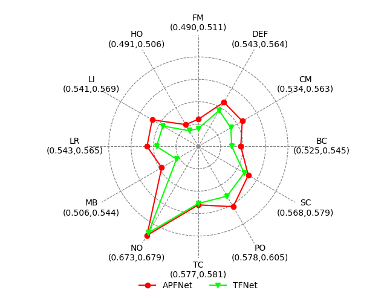

# NOTE

This project was created for the convenience of RGBT Tracking researchers. By utilizing this tool, you will be able to easily implement the following features:

- Use the same tool to evaluate your tracking results on different RGBT datasets.
- The test results of each attribute are available and a radar chart is obtained. You can also test an attribute individually.
- Precision plot and other plot are available.
- Supports GTOT, RGBT210, RGBT234, LasHeR datasets

# Evaluate and Visualize

We provide the ground truth file for RGBT234, so you can directly call it.

```python
from dataset import rgbt234

# Register your tracker
rgbt234(
    tracker_name="APFNet", 
    result_path="./result/RGBT234/APFNet", 
    bbox_type="corner")

rgbt234(
    tracker_name="TFNet", 
    result_path="./result/RGBT234/TFNet", 
    bbox_type="corner",
    prefix="TFNet_")

# Evaluate multiple trackers
pr_dict = rgbt234.MPR()
print(pr_dict["APFNet"][0])

# Evaluate single tracker
apf_pr,_ = rgbt234.MPR("APFNet")
print(apf_pr)

# Evaluate single challenge
pr_tc_dict = rgbt234.MPR(seqs=rgbt234.TC)
sr_tc_dict = rgbt234.MSR(seqs=rgbt234.TC)

# Draw a radar chart of all challenge attributes
rgbt234.draw_attributeRadar(metric_fun=rgbt234.MPR, filename="RGBT234_MPR_radar.png")
rgbt234.draw_attributeRadar(metric_fun=rgbt234.MSR)     # this is ok

# Draw a curve plot.
rgbt234.draw_plot(metric_fun=rgbt234.MPR)
rgbt234.draw_plot(metric_fun=rgbt234.MSR)
```

Any operation requires only one line of code.



