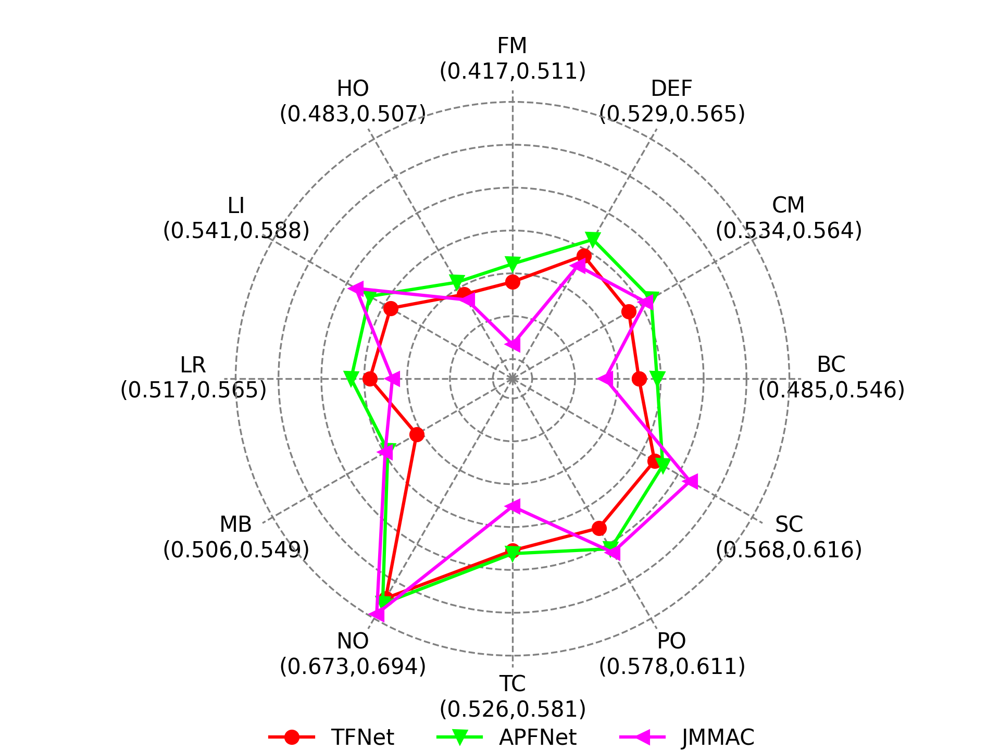

[](https://badge.fury.io/py/rgbt) [](https://pepy.tech/project/rgbt)

# 更新日志

## 2.0

美化了PR/SR图以及雷达图的显示效果
计算效率提升一倍以上


# RGBT toolkit for GTOT, RGBT210, RGBT234, LasHeR

This project was created for the convenience of RGBT Tracking researchers. By utilizing this tool, you will be able to easily implement the following features:

- One for Four
  
Use the same tool to evaluate your tracking results on different RGBT datasets.

- Easy and Fast

We offered all groundtruth file, so you can use it directly.

- Support multiple evaluation needs

The test results of each attribute are available.<br>
You can also analyze individual sequences one by one.<br>
Draw a beautiful image for your paper.

# Is the result reliable ?

> 经测试，由于计算精度的差异，少部分情况下会与官方发布的工具箱产生`0.1%`的误差。**所有数据集都经过论文中给定结果的校准。** <br>
> (校准使用了以下跟踪器提供的文件和结果：APFNet、TFNet、JMMAC、mfDiMP、SOWP、DAFNet) <br>
> It was tested to produce `0.1%` error from the original toolbox in some cases due to differences in computational accuracy. **All datasets are calibrated for the given results in the paper.**


## How to install?

```cmd
pip install rgbt==2.0
```

## Evaluate and Visualize

We provide the ground truth file, so you can directly use it. You just need give it the tracking result path.

```python
from rgbt import RGBT234

rgbt234 = RGBT234()

# Register your tracker
rgbt234(
    tracker_name="APFNet", 
    result_path="./result/RGBT234/APFNet", 
    bbox_type="corner")

rgbt234(
    tracker_name="TFNet", 
    result_path="./result/RGBT234/TFNet", 
    bbox_type="corner",
    prefix="TFNet_")

# Evaluate multiple trackers
pr_dict = rgbt234.MPR()
print(pr_dict["APFNet"][0])

# Evaluate single tracker
apf_pr,_ = rgbt234.MPR("APFNet")
print(apf_pr)

# Evaluate single challenge
pr_tc_dict = rgbt234.MPR(seqs=rgbt234.TC)
sr_tc_dict = rgbt234.MSR(seqs=rgbt234.TC)

# Draw a radar chart of all challenge attributes
rgbt234.draw_attributeRadar(metric_fun=rgbt234.MPR, filename="RGBT234_MPR_radar.png")
rgbt234.draw_attributeRadar(metric_fun=rgbt234.MSR)     # this is ok

# Draw a curve plot.
rgbt234.draw_plot(metric_fun=rgbt234.MPR)
rgbt234.draw_plot(metric_fun=rgbt234.MSR)
```

Any operation requires only one line of code.




## 其他

对于最早的GTOT，后来的RGBT210,234，以及最新的LasHeR，在各种指标上计算方式有比较多的不同，导致大概2个点的误差。
经过仔细比对，发现这些差异并不会导致相对性能的变化。为了与历史跟踪器进行公平比较，我们对于这些差异做了兼容。

这使得在测试GTOT时，需要在测试前额外调用`RGBT_start()`。

```python
from rgbt import GTOT
from rgbt.utils import RGBT_start,RGBT_end

RGBT_start()
gtot = GTOT()

# Register your tracker
gtot(
    tracker_name="APFNet",
    result_path="./result/GTOT/APFNet", 
    bbox_type="corner",
    prefix="")

pr_dict = gtot.MPR()

gtot.draw_plot(metric_fun=gtot.MPR)
gtot.draw_plot(metric_fun=gtot.MSR)

RGBT_end()
```