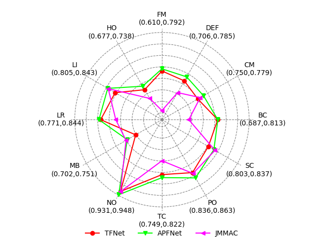
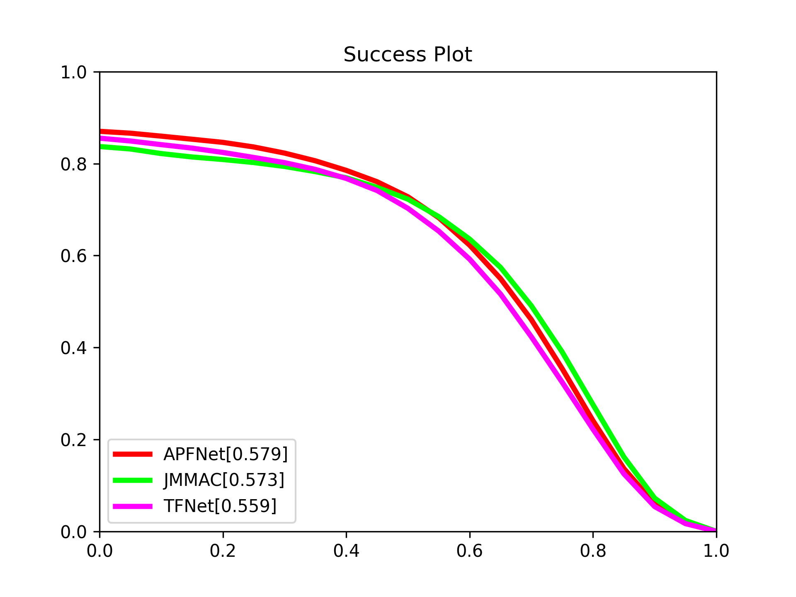

# RGBT toolkit

[](https://badge.fury.io/py/rgbt) [](https://pepy.tech/project/rgbt) [](https://github.com/opacity-black/RGBT_toolkit/blob/master/LICENSE) [](https://github.com/opacity-black/RGBT_toolkit/stargazers)


## 2.0新增

1. 优化了PR/SR图以及雷达图的显示效果。   √
2. 支持导出绘图设置和加载绘图设置        √
3. 计算效率提升一倍以上。               √
4. 支持输出每个序列的time-PR/SR曲线     
5. 支持使用表达式筛选序列
6. 取消老版本RGBT_start()

```python
# 创建设置
# 保存设置
# 读取设置
```
1. 支持查看单个序列的PR/SR分数变化曲线   

2. 支持按条件筛选序列


## 介绍

如果你是RGBT跟踪或者RGB-X跟踪的研究者，本toolkit将极大地方便你开展研究。

- 无需安装matlab
- 自带官方真值文件，提供目标跟踪器结果路径即可测试
- 所有数据集测试一行代码搞定，一行代码出图
- 支持测试不同的属性，或者指定的一部分序列
- 支持测试挑战属性


## 结果可靠性

极少情况下会与官方发布的工具箱产生`0.1%`的误差。**所有数据集都经过论文中给定结果的校准。** <br>
(测试使用了以下跟踪器提供的结果：APFNet、TFNet、JMMAC、mfDiMP、SOWP、DAFNet) <br>


## 安装

```cmd
pip install rgbt==2.0
```

## 使用


```python
from rgbt import RGBT234

rgbt234 = RGBT234()

# Register your tracker
rgbt234(
    tracker_name="APFNet", 
    result_path="./result/RGBT234/APFNet", 
    bbox_type="corner")

rgbt234(
    tracker_name="TFNet", 
    result_path="./result/RGBT234/TFNet", 
    bbox_type="corner",
    prefix="TFNet_")

# Evaluate multiple trackers
pr_dict = rgbt234.MPR()
print(pr_dict["APFNet"][0])

# Evaluate single tracker
apf_pr,_ = rgbt234.MPR("APFNet")
print(apf_pr)

# Evaluate single challenge
pr_tc_dict = rgbt234.MPR(seqs=rgbt234.TC)
sr_tc_dict = rgbt234.MSR(seqs=rgbt234.TC)

# Draw a radar chart of all challenge attributes
rgbt234.draw_attributeRadar(metric_fun=rgbt234.MPR, filename="RGBT234_MPR_radar.png")
rgbt234.draw_attributeRadar(metric_fun=rgbt234.MSR)     # this is ok

# Draw a curve plot.
rgbt234.draw_plot(metric_fun=rgbt234.MPR)
rgbt234.draw_plot(metric_fun=rgbt234.MSR)
```

Any operation requires only one line of code.

</img>
</img>

